Welcome to,

# The Hangman

Live link - [The Hangman](https://hangman-pp3-9fb6a0d7177e.herokuapp.com/)

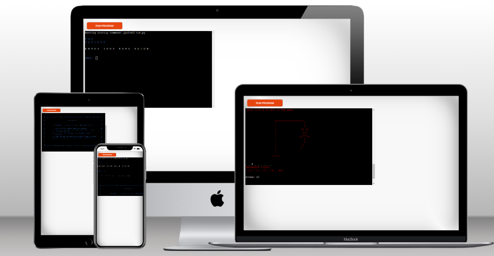

## Introduction

Welcome to Hangman. A game which is both fun and educational. An excellent way to enhance vocabulary and spelling skills while providing entertainment.

## Table of Contents

- [Project Goals](#project-goals)
- [User Experience](#user-experience)
- [Design](#design)
- [Features](#features)
- [Technologies](#technologies-used)
- [Testing](#testing)
- [Bugs](#bugs)
- [Deployment](#deployment)
- [Credits](#credits)

## Project Goals

- __User Goals__

    - Entertainment: Users primarily play Hangman to have fun and be entertained providing an enjoyable gaming experience.
    - Challenge: Users enjoy the challenge of guessing words and figuring out the hidden letters. They want a game that tests their vocabulary, spelling, and problem-solving abilities.
    - Learning: Some users play Hangman to improve their vocabulary and spelling. It can be used as an educational game to reinforce their existing language skills.
    - Nostalgia: For some, playing Hangman is nostalgic, reminding them of their childhood. Reliving old memories and recapturing that sense of nostalgia.
    - Engaging User Interface: Users often appreciate a well-designed and user-friendly interface that makes the game that much more enjoyable to play.
    - Feedback and Interaction: Users look for clear feedback after each guess, indicating whether their guess was right or wrong. They also enjoy interactive elements like a congratulatory message on winning making the game more engaging.

- __Site Owner Goals__

    - Technical Performance: Create a Hangman game to run smoothly and efficiently to provide a positive user experience with a good technical performance, such as load times and server reliability.
    - Education and Learning: Create a Hangman game that is educational, helping users improve their vocabulary, language skills, or other educational objectives.
    - Entertainment: Provide a Hangman game to help the user have fun and be entertained.

[Back to Table of Contents](#table-of-contents)

## User Experience

- __Target Audience__

- Hangman can reach many audiences for many different reasons such as:

    - Children and Students:
        Pre-school pupils learning to spell and expand their vocabulary.
        Primary school students looking for a fun way to reinforce language skills.
        Teachers who want to use the game as an educational tool in the classroom.
    - Word Enthusiasts and Puzzle Lovers:
        Those who enjoy word puzzles, crosswords, and other word-based games.
        Those interested in expanding their language and vocabulary.
    - Language Learners:
        Non English speakers who want to practice and improve the English language.
    - Nostalgia Seekers:
        Those who remember playing Hangman as a traditional pen-and-paper game during their childhood.
        Those looking for a nostalgic gaming experience.

- __User Stories__

    - As a user I can see the Hangman game name in the terminal so I know I'm on the right site.
    - As a user I can see see clear instructions to enter my name below.
    - As a user I can enter my own name.
    - As a user I can see if I do not enter a valid name I get an error message and clear instructions.
    - As a user I can see the rules of the game clearly.
    - As a user I can my own name and clear instruction how to start.
    - As a user I can a random word has been chosen for me and how many letters are in it.
    - As a user I can see the empty gallow where the hangman will appear.
    - As a user I can see the letter spaces for my correct and incorrect letters.
    - As a user I can see my score and tries clearly throughout the game.
    - As a user I can see the hangman forming as I guess uncorrectly.
    - As a user I can see an error message if I choose the same letter twice.
    - As a user I can see a hard luck message with my name when I run out of tries.
    - As a user I can see a congratulatory message when I win.
    - As a user I have the option to play again or finish the game.

[Back to Table of Contents](#table-of-contents)

## Design

- __Design Choices__

Due to this program being built for terminal use, there was not much design. I used basic keyboard letters and symbols for my gallow and hangman with different colours from Colorama.

- __Flowchart__ 

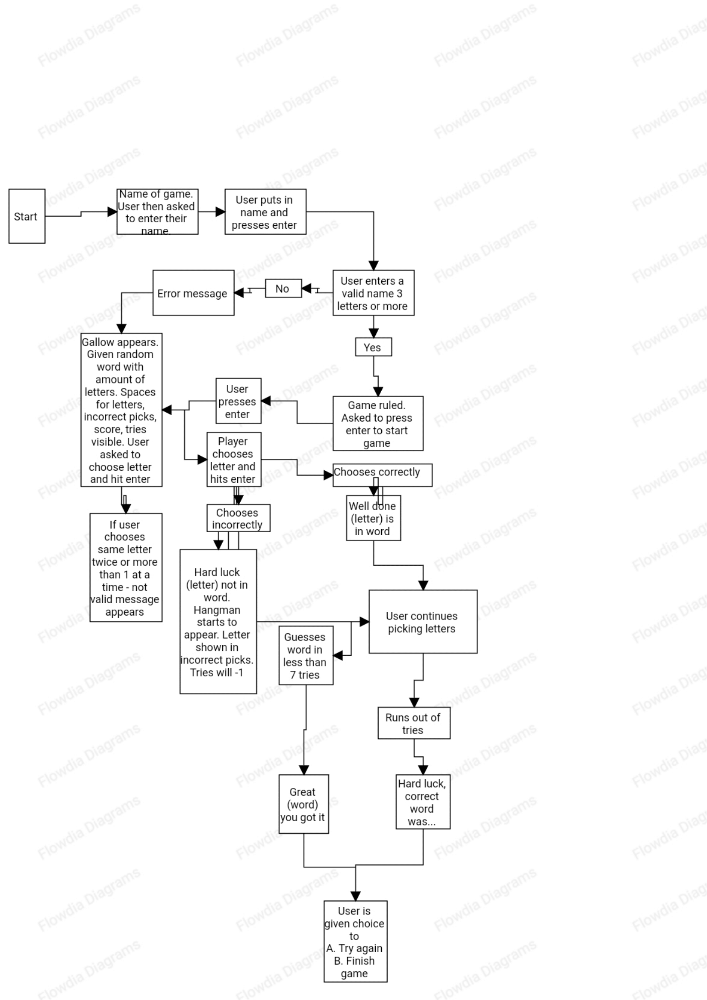

[Back to Table of Contents](#table-of-contents)

## Features

#### Welcome screen

- On the welcome screen the user is met with the game name 'The Hangman' and is instructed to enter their name below

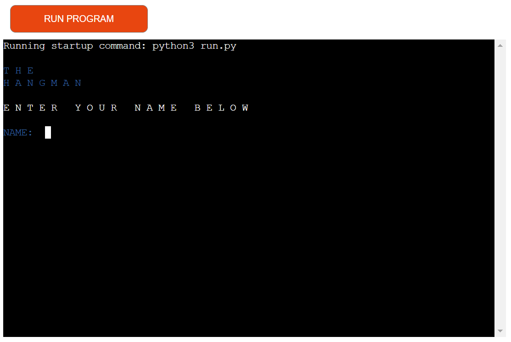

#### Game rules

- Next the user is met with the game rules and an instruction to press enter to start game

#### Game play

- The user then is brought to the game play screen, met by an empty gallow and given a random word with information on how many letters.

- Underneath the user can see the spaces where the letters will populate with correct guesses and below this is where they will see the number of incorrect guesses and their score.

- At the bottom of the page the user will see the amount of tries they have left and the instruction for each go to pick a letter and hit enter.

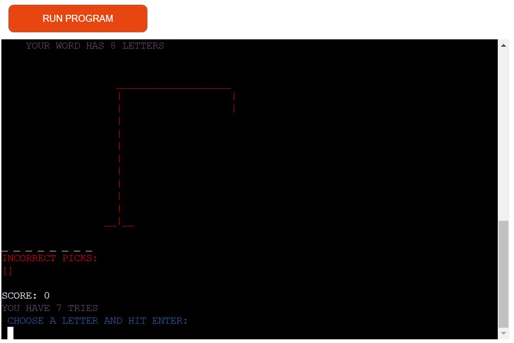

- On completion of the game, win or lose, the user is given the option to try again or finish game.

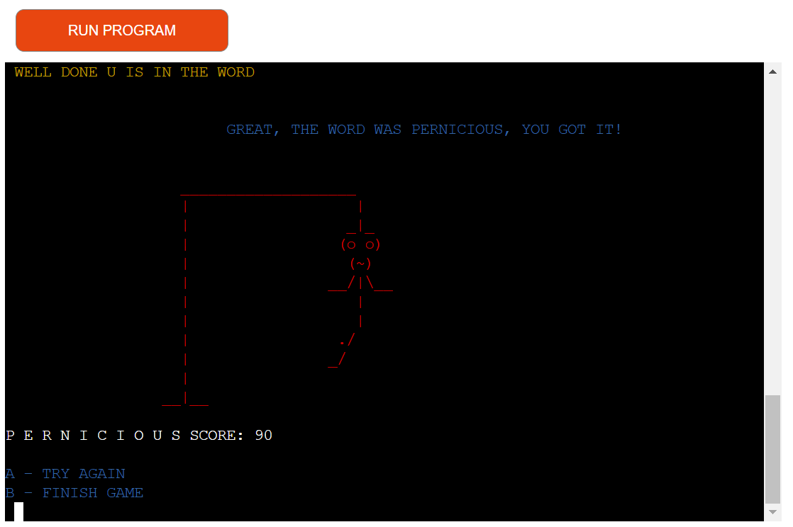

[Back to Table of Contents](#table-of-contents)

### __Technologies Used__

- Python: The program was written entirely in Python.
- Github: Used to store the project's code after being pushed from Git.
- Vscode: The terminal was used to commit my code and push it to Github.
- Git: Was used for version control through the vscode terminal.
- Heroku: Used to deploy, manage, and scale my application.

[Back to Table of Contents](#table-of-contents)

## Testing

#### Python Validation

- I validated my files using Code Institute's Python Linter.

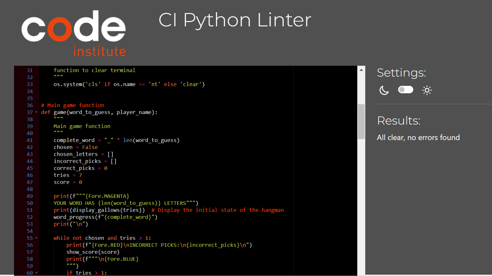
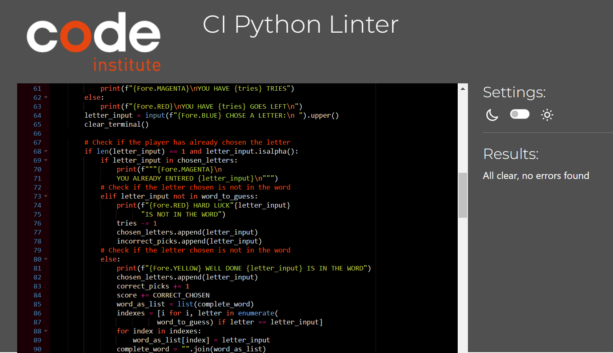
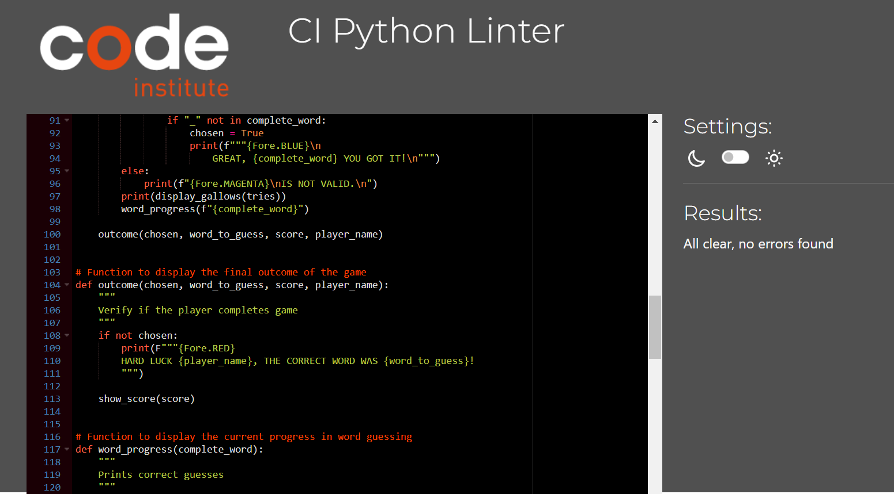
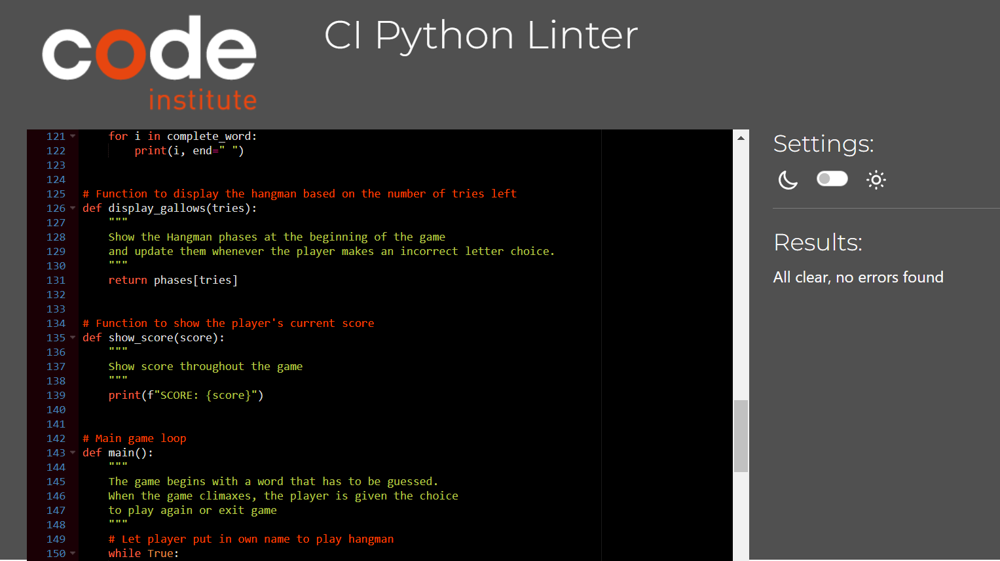
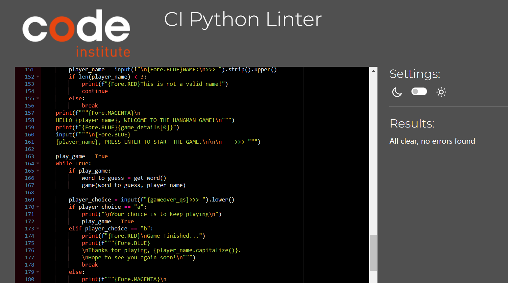
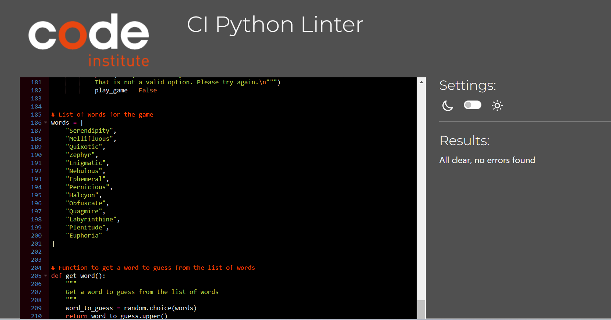
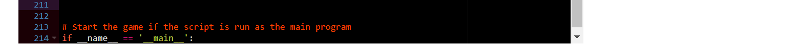

[Back to Table of Contents](#table-of-contents)

## Manual Testing

| Section Tested | Input To Validate | Expected Outcome | Actual Outcome | Pass/Fail |
| -------------- | ----------------- | ---------------- | -------------- | --------- |
| Welcome screen | N/A | Game name appears with instruction for user to enter name below | As expected | Pass |
| Welcome screen | 1 | Error message, this is not a valid name | As expected | Pass |
| Welcome screen | Paul | Move to game play screen | As expected | Pass |
| Game play screen | 2 | Entry not valid message appear | As expected | Pass |
| Game play screen | bb | Entry not valid message appear | As expected | Pass |
| Game play screen | z | Hard luck z is not in the word message appear | As expected | Pass |
| Game play screen | e | Well done e is in the word message appear | As expected | Pass |
| Game play screen | e | You already entered e message to appear | As expected | Pass |
| Game play screen | Max tries | Hard luck Paul, the correct word was " " message appear | As expected | Pass |
| Game play screen | Guess word in less than 7 tries | Great, the word was " ", you got it message | As expected | Pass |
| Game play screen | Guess word in less than 7 tries | Try again and finish game options appear | As expected | Pass |
| Game play screen | Click A for try again option | Game restarts with new random word | As expected | Pass |
| Game play screen | Click B for finish game option | Game finishes | As expected | Pass |

[Back to Table of Contents](#table-of-contents)

## Bugs

| **Bug** | **Fix** |
| --- | --- |
| Bug: In hangman structure syntax errors showing in Python Linter due to single backslashes | Added double backslashes to resolve |
| Bug: On game play page message at top and bottom could not be seen together without scrolling | Refactored spaces |
| Bug: |  |
| Bug: |  |

[Back to Table of Contents](#table-of-contents)

## Deployment

### Version Control

- I used Visual Studio code editor to create my site and pushed to GitHub to the remote repository hangman-pp3.

The following git commands were used throughout development to push code to the remote repo:

- git add <file> - This command was used to add the file(s) to the staging area before they are committed.

- git commit -m “commit message” - This command was used to commit changes to the local repository queue ready for the final step.

- git push - This command was used to push all committed code to the remote repository on github.

### Heroku Deployment

- Heroku provides a platform for hosting web applications, including those built using Python. I deployed my Python-based Hangman game on Heroku, making it accessible to users.

- https://hangman-pp3-9fb6a0d7177e.herokuapp.com/

### Clone a repository code locally

- To clone a repository code locally from Git version control system 
    - Access the repository URL of the remote repository you want to clone
    - Click on the green code button
    - Under HTTPS copy the repository link
    - In your IDE, paste the repository link into the terminal
    - Git will download all the files from the remote repository to your local machine. Once the process is finished, you'll have a local copy of the repository

[Back to Table of Contents](#table-of-contents)

### Forking in GitHub

- To create a personal copy of a public repository to contribute to a project or create your own version of it follow the steps below
    - Go to the GitHub repository you wish to fork
    - Click the fork button on the top right corner of the chosen repository page
    - After forking the repository, you will be redirected to your own version of the repository. This version is the same as the original.
    - You can now make changes to the code, adding your own features, fix issues, or modify code within your fork. These changes do not affect the original repository.
    - If you want to send your changes back to the owner, you can do so by creating a "Pull Request." They can review your changes and decide whether they want to add it to their repository.

## Credits

### Code
- I got the code for clearing the terminal from [stack overflow](https://stackoverflow.com/questions/2084508/clear-terminal-in-python)

### __Design__
- I built my flowchart using the app [Flowdia Diagrams](https://play.google.com/store/apps/details?id=com.bezapps.flowdia)

## __Acknowledgements__
- I would like to give thanks to my cohort lead Jamie O Neill for his commited work on our slack study groups and one to one huddle sessions when called upon.
- I would like to praise those who show up and brainstorm on our weekly study group, every opinion makes a difference.
- I would like to give thanks to my mentor for his guidance throughout and taking time out to organise a meeting even when fully booked.

[Back to Table of Contents](#table-of-contents)